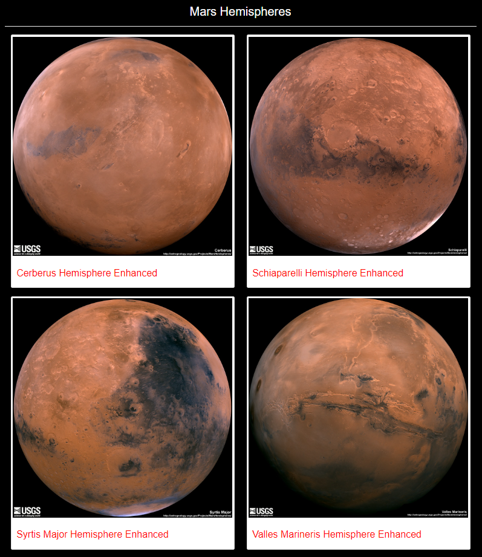

# Mission_to_Mars

## Purpose
Construct a web app that scrapes full-resolution images of Mars' 4 hemispheres and the titles of those images as well as other information on Mars from other websites.

### Scrape Full-Resolution Mars Hemisphere Images and Titles
Using BeautifulSoup and Splinter, scraped full-resolution images of Mars’s hemispheres and the titles of those images.

### Update the Web App with Mars’s Hemisphere Images and Titles
Using Python and HTML, added code to your scraping.py file, update Mongo database, and modified index.html file so the webpage contains all the information collected as well as the full-resolution image and title for each hemisphere image.

### Add Bootstrap 3 Components
Updated web app to make it mobile-responsive, and add additional Bootstrap 3 components:
* Changed "Scrape New Data" button to red.
* Changed background to black.
* Changed "Mission to Mars" heading to maroon.
* Changed "Mars News" section to white.
* Changed "Featured Mars Image" heading to white.
* Changed "Mars Facts" section to red.
* Changed "Mars Hemispheres" heading to white.
* Changed captions in "Mars Hemispheres" section to red.

